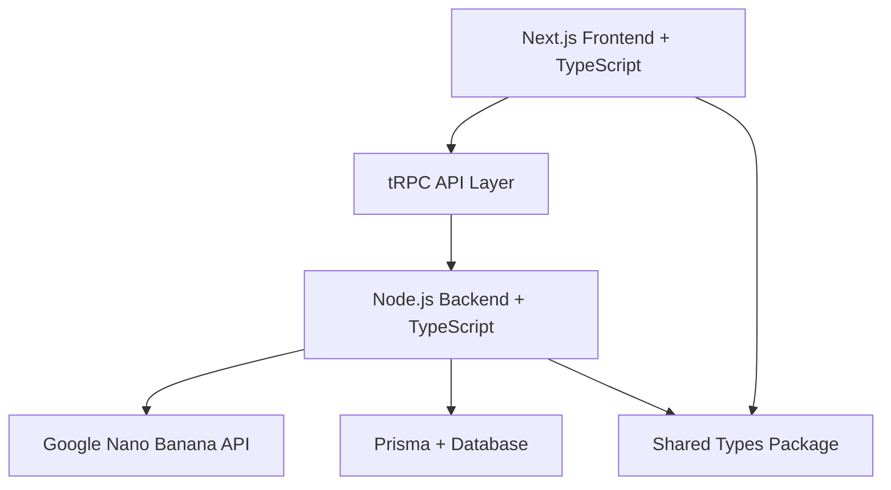

# Design Document

## Overview

买家秀MVP是一个基于Google Nano Banana API的TypeScript全栈Web应用，允许用户上传场景照片，选择商品，并通过自然语言描述来生成AI融合的买家秀照片。该系统采用现代TypeScript生态系统，确保类型安全和开发体验优化。

## Steering Document Alignment

### Technical Standards
采用TypeScript最佳实践和现代开发规范：
- 严格的TypeScript配置和类型检查
- 统一的代码风格和ESLint规则
- 组件化和模块化设计原则
- 完整的类型定义和接口设计

### Project Structure
基于TypeScript项目的标准目录结构：
- 前后端代码分离，共享类型定义
- 分层架构设计
- 配置文件TypeScript化

## Code Reuse Analysis

### TypeScript生态复用
- **共享类型定义**: 前后端共享接口和数据模型类型
- **工具函数库**: 类型安全的通用工具函数
- **验证库**: 运行时类型检查和数据验证

### 计划创建的可复用组件
- **类型安全的API客户端**: 完整的类型推导
- **表单组件**: 基于泛型的可复用表单
- **文件处理工具**: 类型化的文件上传和处理
- **状态管理**: TypeScript友好的状态管理方案

## Architecture

采用TypeScript全栈开发的最佳实践架构：

### Modular Design Principles
- **Type-First Design**: 优先定义类型，再实现逻辑
- **Domain-Driven Structure**: 按业务领域组织代码
- **Dependency Injection**: 基于接口的依赖注入
- **Generic Components**: 利用泛型创建可复用组件



## Technology Stack

### 前端技术栈（TypeScript优化）
- **框架**: **Next.js 14** (App Router) - 最佳TypeScript支持，SSR/SSG
- **状态管理**: **Zustand** - 轻量级，优秀TypeScript支持
- **UI组件**: **shadcn/ui** - 基于Radix UI，完全TypeScript
- **样式**: **Tailwind CSS** + **CSS Modules**
- **表单**: **React Hook Form** + **Zod** - 类型安全表单验证
- **HTTP客户端**: **tRPC** - 端到端类型安全API

### 后端技术栈（TypeScript优化）
- **运行时**: **Node.js 18+** + **TypeScript 5.0+**
- **框架**: **Fastify** - 更好的TypeScript支持than Express
- **API层**: **tRPC** - 类型安全的API定义
- **数据验证**: **Zod** - 运行时类型验证
- **文件处理**: **@fastify/multipart** - TypeScript友好
- **HTTP客户端**: **ofetch** - 现代化，完整类型支持

### 数据层技术栈
- **ORM**: **Prisma** - 优秀的TypeScript支持和类型生成
- **数据库**: **SQLite** (MVP) / **PostgreSQL** (生产)
- **缓存**: **Redis** (可选)

### 开发工具链（TypeScript优化）
- **构建工具**: **Turbo** (Monorepo) 或 **Vite**
- **类型检查**: **TypeScript 5.0+** 严格模式
- **代码规范**: **ESLint** + **@typescript-eslint**
- **格式化**: **Prettier**
- **测试**: **Vitest** + **Testing Library**
- **包管理**: **pnpm** (更好的monorepo支持)

## Components and Interfaces

### 共享类型定义

```typescript
// types/api.ts
export interface ImageUpload {
  id: string;
  filename: string;
  filepath: string;
  mimetype: string;
  size: number;
  uploadedAt: Date;
}

export interface Product {
  id: string;
  name: string;
  description: string;
  imageUrl: string;
  category: string;
  isActive: boolean;
}

export interface UserDescriptions {
  position: string;
  scene: string;
  style: string;
  angle: string;
  lighting: string;
}

export interface GenerationRequest {
  id: string;
  userId: string;
  originalImageId: string;
  productId: string;
  descriptions: UserDescriptions;
  generatedPrompt: string;
  resultImageUrl?: string;
  status: 'pending' | 'processing' | 'completed' | 'failed';
  feedback?: UserFeedback;
  createdAt: Date;
  completedAt?: Date;
}

export interface UserFeedback {
  rating: number;
  styleMatch: number;
  quality: number;
  comments?: string;
}
```

### tRPC API定义

```typescript
// server/api/root.ts
import { z } from 'zod';
import { createTRPCRouter, publicProcedure } from './trpc';

export const appRouter = createTRPCRouter({
  // 文件上传
  uploadImage: publicProcedure
    .input(z.object({
      file: z.custom<File>(),
    }))
    .mutation(async ({ input }) => {
      // 处理文件上传，返回类型安全的结果
      return {
        id: 'generated-id',
        url: 'file-url',
      } satisfies { id: string; url: string };
    }),

  // 商品列表
  getProducts: publicProcedure
    .query(async () => {
      // 返回商品列表，类型自动推导
      return [] as Product[];
    }),

  // 生成图像
  generateImage: publicProcedure
    .input(z.object({
      imageId: z.string(),
      productId: z.string(),
      descriptions: z.object({
        position: z.string(),
        scene: z.string(),
        style: z.string(),
        angle: z.string(),
        lighting: z.string(),
      }),
    }))
    .mutation(async ({ input }) => {
      // 调用Google Nano Banana API
      return {
        requestId: 'generated-id',
        status: 'processing',
      } satisfies { requestId: string; status: string };
    }),
});

export type AppRouter = typeof appRouter;
```

### 前端组件设计（TypeScript）

#### PhotoUploadComponent
```typescript
interface PhotoUploadProps {
  onUpload: (file: ImageUpload) => void;
  onError: (error: Error) => void;
  maxSize?: number;
  allowedTypes?: string[];
}

export const PhotoUpload: React.FC<PhotoUploadProps> = ({
  onUpload,
  onError,
  maxSize = 5 * 1024 * 1024, // 5MB
  allowedTypes = ['image/jpeg', 'image/png']
}) => {
  // TypeScript实现
};
```

#### ProductSelectorComponent
```typescript
interface ProductSelectorProps {
  products: Product[];
  selectedProduct?: Product;
  onSelect: (product: Product) => void;
  loading?: boolean;
}

export const ProductSelector: React.FC<ProductSelectorProps> = ({
  products,
  selectedProduct,
  onSelect,
  loading = false
}) => {
  // TypeScript实现
};
```

#### DescriptionFormComponent
```typescript
interface DescriptionFormProps {
  onSubmit: (descriptions: UserDescriptions) => void;
  defaultValues?: Partial<UserDescriptions>;
  loading?: boolean;
}

export const DescriptionForm: React.FC<DescriptionFormProps> = ({
  onSubmit,
  defaultValues,
  loading = false
}) => {
  // 使用React Hook Form + Zod
  const form = useForm<UserDescriptions>({
    resolver: zodResolver(userDescriptionsSchema),
    defaultValues,
  });

  // TypeScript实现
};
```

### 后端服务设计（TypeScript）

#### APIService类型化实现
```typescript
// services/nanoBananaService.ts
export class NanoBananaAPIService {
  private readonly apiKey: string;
  private readonly baseUrl = 'https://generativelanguage.googleapis.com/v1beta';

  constructor(apiKey: string) {
    this.apiKey = apiKey;
  }

  async generateImage(prompt: string): Promise<{
    success: boolean;
    imageUrl?: string;
    error?: string;
  }> {
    try {
      // 类型安全的API调用实现
      const response = await ofetch<{
        candidates: Array<{
          content: {
            parts: Array<{
              inline_data?: {
                data: string;
                mime_type: string;
              };
            }>;
          };
        }>;
      }>(`${this.baseUrl}/models/gemini-2.5-flash-image-preview:generateContent`, {
        method: 'POST',
        headers: {
          'Authorization': `Bearer ${this.apiKey}`,
          'Content-Type': 'application/json',
        },
        body: {
          contents: prompt,
        },
      });

      return {
        success: true,
        imageUrl: this.processImageResponse(response),
      };
    } catch (error) {
      return {
        success: false,
        error: error instanceof Error ? error.message : 'Unknown error',
      };
    }
  }

  private processImageResponse(response: any): string {
    // 类型安全的响应处理
    // ...
  }
}
```

## Error Handling

### TypeScript错误类型化
```typescript
// types/errors.ts
export class APIError extends Error {
  constructor(
    message: string,
    public statusCode: number,
    public code: string
  ) {
    super(message);
    this.name = 'APIError';
  }
}

export class ValidationError extends Error {
  constructor(
    message: string,
    public field: string
  ) {
    super(message);
    this.name = 'ValidationError';
  }
}

export type AppError = APIError | ValidationError | Error;
```

### 类型安全的错误处理
```typescript
// utils/errorHandler.ts
export const handleApiError = (error: unknown): {
  message: string;
  code: string;
} => {
  if (error instanceof APIError) {
    return {
      message: error.message,
      code: error.code,
    };
  }
  
  if (error instanceof ValidationError) {
    return {
      message: `Validation failed for ${error.field}: ${error.message}`,
      code: 'VALIDATION_ERROR',
    };
  }

  return {
    message: 'An unexpected error occurred',
    code: 'UNKNOWN_ERROR',
  };
};
```

## Testing Strategy

### TypeScript测试配置
- **单元测试**: **Vitest** - 原生TypeScript支持
- **组件测试**: **React Testing Library** + TypeScript
- **API测试**: **Supertest** + 类型定义
- **E2E测试**: **Playwright** - 优秀的TypeScript支持

### 类型测试
```typescript
// tests/types.test.ts
import { expectTypeOf } from 'vitest';
import type { GenerationRequest, UserDescriptions } from '../types';

test('type definitions', () => {
  expectTypeOf<GenerationRequest>().toEqualTypeOf<{
    id: string;
    userId: string;
    originalImageId: string;
    productId: string;
    descriptions: UserDescriptions;
    generatedPrompt: string;
    resultImageUrl?: string;
    status: 'pending' | 'processing' | 'completed' | 'failed';
    feedback?: UserFeedback;
    createdAt: Date;
    completedAt?: Date;
  }>();
});
```

## Project Structure

```
buyershow/
├── packages/
│   ├── shared-types/          # 共享类型定义
│   └── config/               # 共享配置
├── apps/
│   ├── web/                  # Next.js前端
│   │   ├── src/
│   │   │   ├── app/          # App Router页面
│   │   │   ├── components/   # React组件
│   │   │   ├── hooks/        # 自定义Hooks
│   │   │   ├── store/        # Zustand状态管理
│   │   │   └── utils/        # 工具函数
│   │   └── tsconfig.json
│   └── api/                  # Fastify后端
│       ├── src/
│       │   ├── routes/       # API路由
│       │   ├── services/     # 业务逻辑
│       │   ├── utils/        # 工具函数
│       │   └── types/        # 后端特定类型
│       └── tsconfig.json
├── prisma/                   # 数据库架构
└── turbo.json               # Monorepo配置
```

## Development Workflow

### TypeScript开发体验优化
- **严格类型检查**: `strict: true`, `noImplicitAny: true`
- **路径映射**: `@/*` 路径别名配置
- **自动类型生成**: Prisma自动生成数据库类型
- **API类型同步**: tRPC自动类型推导
- **热重载**: Vite/Next.js快速开发反馈

### 代码质量保证
- **Pre-commit hooks**: 类型检查 + ESLint + Prettier
- **CI/CD**: 自动化类型检查和测试
- **类型覆盖率**: 确保关键代码路径的类型安全